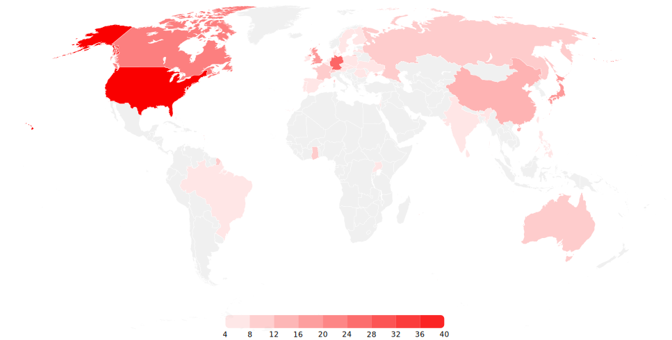

# Contributors MAP CLI 

Example result: 



The aim of this project is to create a data visualisation map for a repository showing the locations of project contributors. 


## usage: 

If you want to test this through the CLI you need to run:

You can set the GitHub token with this command: 

```cmd
node cli.js set GITHUB_TOKEN
```

If you set the GitHub token with previous code, you can omit the token requirement when you draw the map.

```cmd
node cli.js OWENER/REPO GITHUB_TOKEN
```

or you can use the `index.js` file and write a list of projects in the array to print them.

## Development Process: 


# Aknowledgement: 

Thanks for: 

[Daniel Lenton](https://danlenton.com/) for talking about the idea of needing a map for contributors at [Hadith Tech podcast](https://www.youtube.com/watch?v=layth8Cyaus&t=31s), 

[Simon Tunaitis](https://github.com/tunaitis) for writing the [go code](https://github.com/tunaitis/contributor-map) which been turned into JS, 

[Brian Douglas](https://github.com/bdougie) for expressing his [interest](https://github.com/orgs/open-sauced/discussions/7) in this project, 

[Prof. Akif Eyler](https://github.com/maeyler) for his impact on my thoughts, 

My family for the whole support they provide,  

And for all the developers who created some code we used and learned from. 
